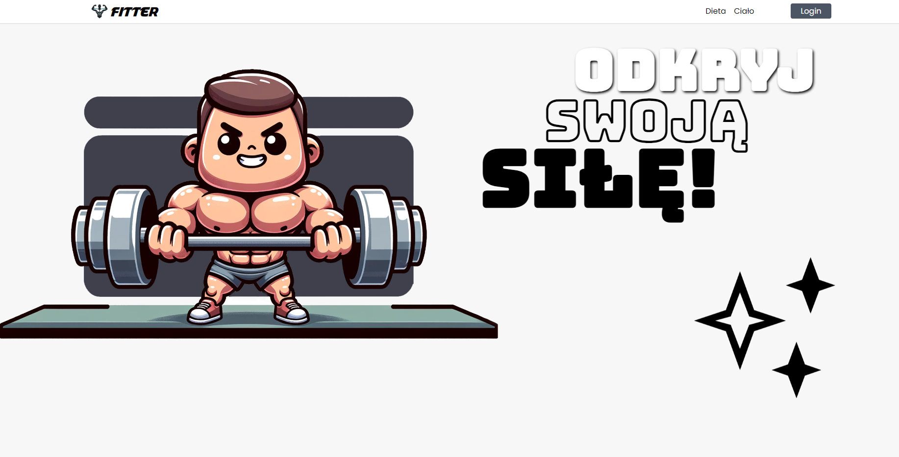

<h1>Fitter</h1>
<h3>Gym and Diet Tracker Web Application</h3>

The application is available at the <a href="https://patchker.com/works/fitter/">link</a>.

Server side code is available at the <a href="github.com/patchker/fitter-server">link</a>.

Welcome to my Gym and Diet Tracker, a comprehensive web application designed for fitness enthusiasts and dietitians. This platform is dedicated to helping users monitor their gym progress and track dietary habits effectively. Built with a focus on user-friendly experience and functionality, my application leverages the latest in web technology to deliver a seamless and productive user experience.

<h3>Features</h3>

Training Progress Tracking: Log your workouts, track your progress over time, and set fitness goals. Intuitive interface makes it easy to keep a detailed record of your training sessions, including exercises, sets, reps, and weight lifted.

Dietary Habits Monitoring: Keep a close eye on your meal intake with our dietary tracker. Record your daily meals, track calories, and analyze the nutritional content of your food to ensure you're meeting your dietary goals.

Nutritional Component Analysis: Gain insights into your eating habits with detailed breakdowns of nutritional components. My app provides comprehensive analysis of macros and micros to help you understand your diet better.

Dietitian Platform: A dedicated space for dietitians to create and manage dietary plans for their clients. This feature allows diet professionals to offer personalized advice and track the dietary progress of their clients, all within the same platform.

<h3>Technologies</h3>
This application is built using cutting-edge web technologies to ensure a robust and responsive user experience:

<b>Django</b>: A high-level Python Web framework that encourages rapid development and clean, pragmatic design.

<b>REST API</b>: Utilized for seamless communication between the front-end and back-end, ensuring a smooth and efficient user experience.

<b>React JS</b>: A JavaScript library for building user interfaces, React JS allows for a dynamic and responsive client-side experience.

<b>FastAPI</b> - a modern, fast web framework for building APIs with Python based on standard Python type hints. 

